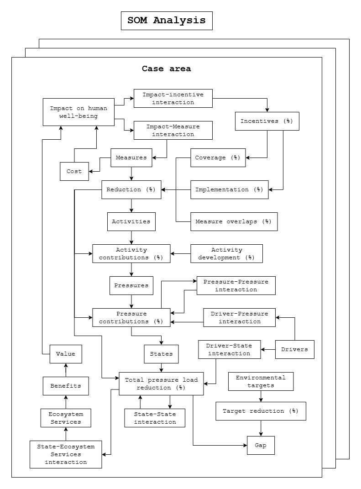

The original framework developed in the [ACTION](https://helcom.fi/helcom-at-work/projects/action/) project was further expanded on in the [BLUES](https://helcom.fi/helcom-at-work/projects/blues/) project. The figure below highlights the additions. 



Figure 1. Expanded SOM model, as developed in HELCOM BLUES.

The main components added are:

- Drivers
- Pressure-Pressure and State-State interactions
- Ecosystem services and benefits
- Impacts on human well-being
- Incentives

In order to include these in future versions of the tool, care has to be taken in order to implement them in a logical way in accordance with the already existing logic. The sections below suggest potential ways of implementing these components, given that the data on them is available. 

## Drivers

The drivers have two main vectors into the existing framework:

- Driver-Pressure interaction
- Driver-State interaction

These could be implemented as two tables, linking driver and pressure/state IDs together along with a multiplier affecting the reduction on pressure/TPL levels.

#### ``som_tools.py``

If the data is not already as described above, add a method to handle the preprocessing of the input data:

```
def read_drivers(src):
    Arguments:
        src: source of input data
    Returns:
        driver_pressure_interactions (DataFrame): 
            driver (Any): driver ID
            pressure (Any): pressure ID
            area_id (Any): area ID, if the drivers are area specific
            multiplier (float): multiplier applied to pressure contributions
        driver_state_interaction (DataFrame):
            driver (Any): driver ID
            state (Any): state ID
            area_id (Any): area ID, if the drivers are area specific
            multiplier (float): multiplier applied to total pressure load reductions
```

#### ``som_app.py``

Add driver-pressure interactions in `build_changes()`:

```
# after pressure reductions section, before total pressure load reductions section
for each area:
    - adjust each relevant pressure level
    - adjust pressure contributions to reflect changes
```

Add driver-state interactions in `build_changes()`:

```
# after total pressure load reductions section
for each area:
    - adjust each relevant total pressure load level
    - adjust each relevant state pressure level
```

## Pressure-Pressure and State-State interaction

The pressure-pressure and state-state interactions work similarly to the measure overlaps, represented as tables linking IDs if the same type together.

While the subpressures data reflect how a pressure makes up for a portion of another pressure, pressure-pressure interactions describe how the change in one pressure affects another pressure. 

#### ``som_tools.py``

If the data is not already as described above, add two methods to handle the preprocessing of the input data:

```
def read_pressure_overlaps(src):
    Arguments:
        src: source of input data
    Returns:
        pressure_overlaps (DataFrame): 
            overlapping (Any): overlapping pressure ID
            overlapped (Any): overlapped pressure ID
            state (Any): state ID
            area_id (Any): area ID, if the overlaps are area specific
            multiplier (float): multiplier applied to overlapped pressure

def read_state_overlaps(src):
    Arguments:
        src: source of input data
    Returns:
        state_overlaps (DataFrame): 
            overlapping (Any): overlapping state ID
            overlapped (Any): overlapped state ID
            area_id (Any): area ID, if the overlaps are area specific
            multiplier (float): multiplier applied to overlapped state
```

#### ``som_app.py``

Add interactions in `build_changes()`:

```
# in total pressure load reductions section, in pressure contributions sub-section, after subpressures sub-sub-section
- adjust overlapped pressure level change by relevant overlapping pressure multipliers

# after total pressure load reductions section
- adjust total pressure load level changes by relevant overlapping state multipliers
```

## Ecosystem services and benefits

The ecosystem services share similarities with the states, and could also be implemented as a table, linking the states to the ecosystem services by ID along with a multiplier to reflect the ecosystem service levels. These levels would then be affected by the total pressure load reductions accordingly. From the ecosystem services, the benefits and their produced value could then be determined.

However, the inclusion of these have not been completely mapped out, and as such a solution on their complete implementation is not produced here. 

Once identified, it is likely that these calculations can be added after those in `build_changes()` in `som_app.py`.

## Impacts on human well-being

The impacts on human well-being are dependent on the Value properties calculated from the Ecosystem benefits, as well as the Cost property derived from the measures. To achieve this, the measures data needs to be expanded to include the cost of each measure. Given the input data, the impacts should act as a transformation function, using the values and costs to produce the impact-incentive and impact-measure interaction data. This data could likely take the form as similar multipliers detailed previously on this page. However, as the transformation functions were not mapped out at the time of writing, a solution on their implementation is not produced here. 

## Incentives

The incentives once again work as multipliers, this time on the coverage and implementation properties of the measures in the cases data, and thus requires linking of the incentives to either the cases or measures data. However, due to not being mapped out, a solution is not included here. 

