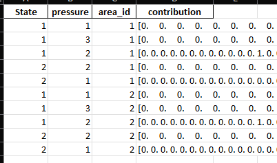

## Intro

The new input data consists of one file:

- exampleInputData.xlsx

Example input data has been provided in the ```data``` directory.

For the previous version of the input data, see [Input data (legacy)](input-data-legacy.md).

Please note that most column names are case sensitive.

## Probability Distributions

When the input data contains probability distributions, they will follow this format:

- The distribution is represented as a string
- The string is enclosed by square brackets [ ]
- Entries are space-separated
- Each entry in the distribution is the probability for a random pick to be within that discrete interval within the range [0, 1], where the distance is determined by the total number of entries in the distribution, such that the first and last entries represent 0 % and 100 % and each step in between is 100 / (N - 1).

## Data Structure

#### ```sheet:measure```


- Unique identifiers for measures

#### ```sheet:activity```


- Unique identifiers for activities

#### ```sheet:pressure```


- Unique identifiers for pressures

#### ```sheet:state```


- Unique identifiers for states

#### ```sheet:area```


- Unique identifiers for areas

#### ```sheet:cases```


- Implemented measure cases, all rows are independent
    - ```column:ID```: Unique case id
    - ```column:measure```: Measure type ID, linked to ```sheet:measure```
    - ```column:activity```: Relevant Activities, linked to ```sheet:activity```, the value 0 (zero) means all relevant activities affected by the measure
    - ```column:pressure```: Relevant Pressures, linked to ```sheet:pressure```, the value 0 (zero) means all relevant pressures affected by the measure
    - ```column:state```: Relevant States, linked to ```sheet:state```, the value 0 (zero) means all relevant states affected by the measure
    - ```column:coverage```: Multiplier (fraction), represents how much of the area is covered by the measure
    - ```column:implementation```: Multiplier (fraction), represents how much of the measure is implemented
    - ```column:area_id```: Area ID, linked to ```sheet:Area ID```

#### ```sheet:measure_effects```


- Activity-Pressure links, how much the individual activities contribute to the pressures
    - ```column:Activity```: Activity ID, linked to ```sheet:activity```
    - ```column:Pressure```: Pressure ID, linked to ```sheet:pressure```
    - ```column:area_id```: Area ID, linked to ```sheet:area```
    - ```column:contribution```: Measure reduction effect, probability distribution, see [Probability Distributions](#probability-distributions)

#### ```sheet:activity_contributions```


- Measure reduction effects on activity-pressure pairs
    - ```column:measure```: Activity ID, linked to ```sheet:measure```
    - ```column:activity```: Activity ID, linked to ```sheet:activity```
    - ```column:pressure```: Pressure ID, linked to ```sheet:pressure```
    - ```column:state```: Pressure ID, linked to ```sheet:state```
    - ```column:probability```: Activity contribution, probability distribution, see [Probability Distributions](#probability-distributions)

#### ```sheet:pressure_contributions```


- Pressure-State links, how much the individual pressures contribute to the states
    - ```column:State```: State ID, linked to ```sheet:state```
    - ```column:pressure```: Pressure ID, linked to ```sheet:pressure```
    - ```column:area_id```: Area ID, linked to ```sheet:area```
    - ```column:contribution```: Pressure contribution, probability distribution, see [Probability Distributions](#probability-distributions)

#### ```sheet:thresholds```


- Environmental target thresholds, how much the individual states need to be reduced to reach the set targets
    - ```column:State```: State ID, linked to ```sheet:state```
    - ```column:area_id```: Area ID, linked to ```sheet:area```
    - ```column:PR/10/25/50```: Probability distributions for GES (PR) and 10/25/50 % reduction thresholds, see [Probability Distributions](#probability-distributions)

#### ```sheet:overlaps```


- Interaction between separate measures, how joint implementation affects measure efficiency
    - ```column:Overlap```: Overlap ID
    - ```column:Pressure```: Pressure ID, linked to ```sheet:pressure```
    - ```column:Activity```: Activity ID, linked to ```sheet:activity```
    - ```column:Overlapping```: Overlapping measure ID, linked to ```sheet:measure```
    - ```column:Overlapped```: Overlapped measure ID, linked to ```sheet:measure```
    - ```column:Multiplier```: Multiplier (fraction), how much of the ```column:Overlapped``` measure's effect will be observed if ```column:Overlapping``` is also implemented

#### ```sheet:development_scenarios```


- Activity development scenarios, how much each activity is expected to change during various scenarios, each value is a multiplier
    - ```column:Activity```: Activity ID, linked to ```sheet:activity```
    - ```column:BAU```: Business As Usual, activity change without extra action (fraction)
    - ```column:ChangeMin```: Lowest potential change (fraction)
    - ```column:ChangeML```: Most likely change (fraction)
    - ```column:ChangeMax```: Highest potential change (fraction)

#### ```sheet:subpressures```


- Links between separate pressures, where *subpressures* make up part of *state pressures*
    - ```column:Reduced pressure```: Subpressure ID, linked to ```sheet:pressure```
    - ```column:State pressure```: State pressure ID, linked to ```sheet:pressure```
    - ```column:Equivalence```: Equivalence between ```column:Reduced pressure``` and ```column:State pressure```, i.e. how much of the *state pressure* is made up of the *subpressure*, where values between 0 and 1 are treated as fractions, and other values as either no quantified equivalence or no reduction from pressures
    - ```column:State```: State ID, linked to ```sheet:state```
    - ```column:Multiplier```: Multiplier (fraction), how much of the reduction in ```column:Reduced pressure``` should be applied to ```column:State pressure```, determined from ```column:Equivalence```

