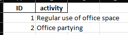
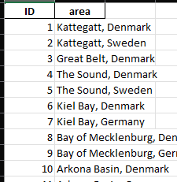
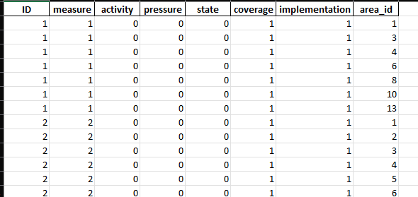
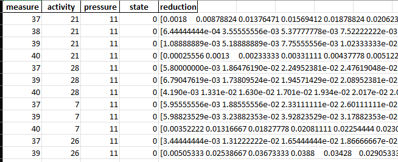
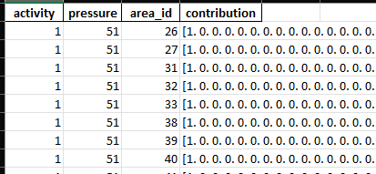
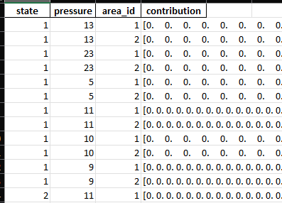
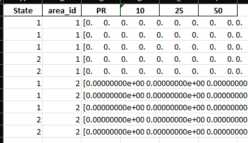
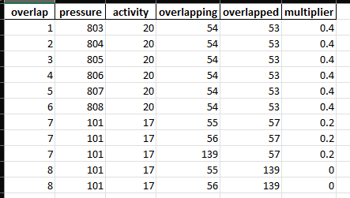
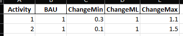
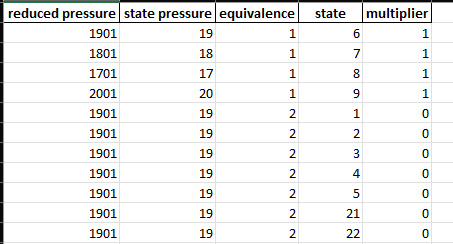

## Intro

The new input data consists of one file:

- exampleInputData.xlsx

Example input data has been provided in the ```data``` directory.

For the previous version of the input data, see [Input data (legacy)](input-data-legacy.md).

Please note that most column names are case sensitive. Additionally, certain characters are not allowed 
in the name columns of the ID sheets due to OS restrictions, and may lead to crashes or unexpected behavior. 
To avoid this, try to not use special characters or letters in the names. 

## Probability Distributions

When the input data contains probability distributions, they will follow this format:

- The distribution is represented as a string
- The string is enclosed by square brackets [ ]
- Entries are space-separated
- Each entry in the distribution is the probability for a random pick to be within that discrete interval within the range [0, 1], where the distance is determined by the total number of entries in the distribution, such that the first and last entries represent 0 % and 100 % and each step in between is 100 / (N - 1)

## Data Structure

#### ```sheet:measure```


| Column | Type | Description |
| ------ | ---- | ----------- |
| ID | Text | Unique measure identifier |
| measure | Text | Measure description / name |

#### ```sheet:activity```


| Column | Type | Description |
| ------ | ---- | ----------- |
| ID | Text | Unique activity identifier |
| activity | Text | Activity description / name |

#### ```sheet:pressure```


| Column | Type | Description |
| ------ | ---- | ----------- |
| ID | Text | Unique pressure identifier |
| pressure | Text | Pressure description / name |

#### ```sheet:state```


| Column | Type | Description |
| ------ | ---- | ----------- |
| ID | Text | Unique state identifier |
| state | Text | State description / name |

#### ```sheet:area```


| Column | Type | Description |
| ------ | ---- | ----------- |
| ID | Text | Unique area identifier |
| area | Text | Area description / name |

#### ```sheet:cases```


- Implemented measure cases, all rows are independent

| Column | Type | Description |
| ------ | ---- | ----------- |
| ID | Text | Unique case identifier |
| measure | Text | Measure ID, linked to ```sheet:measure``` |
| activity | Text | Activity ID, linked to ```sheet:activity```, the value 0 (zero) means all relevant activities affected by the measure |
| pressure | Text | Pressure ID, linked to ```sheet:pressure```, the value 0 (zero) means all relevant pressures affected by the measure |
| state | Text | State ID, linked to ```sheet:state```, the value 0 (zero) means all relevant states affected by the measure |
| coverage | Number | Multiplier (fraction), represents how much of the area is covered by the measure |
| implementation | Number | Multiplier (fraction), represents how much of the measure is implemented |
| area_id | Text | Area ID, linked to ```sheet:Area ID``` |

#### ```sheet:measure_effects```


- Activity-Pressure links, how much the individual activities contribute to the pressures

| Column | Type | Description |
| ------ | ---- | ----------- |
| activity | Text | Activity ID, linked to ```sheet:activity``` |
| pressure | Text | Pressure ID, linked to ```sheet:pressure``` |
| area_id | Text | Area ID, linked to ```sheet:area``` |
| contribution | Text | Measure reduction effect, probability distribution, see [Probability Distributions](#probability-distributions) |

#### ```sheet:activity_contributions```


- Measure reduction effects on activity-pressure pairs

| Column | Type | Description |
| ------ | ---- | ----------- |
| activity | Text | Activity ID, linked to ```sheet:activity``` |
| pressure | Text | Pressure ID, linked to ```sheet:pressure``` |
| state | Text | Pressure ID, linked to ```sheet:state``` |
| probability | Text | Activity contribution, probability distribution, see [Probability Distributions](#probability-distributions) |

#### ```sheet:pressure_contributions```


- Pressure-State links, how much the individual pressures contribute to the states

| Column | Type | Description |
| ------ | ---- | ----------- |
| state | Text | State ID, linked to ```sheet:state``` |
| pressure | Text | Pressure ID, linked to ```sheet:pressure``` |
| area_id | Text | Area ID, linked to ```sheet:area``` |
| contribution | Text | Pressure contribution, probability distribution, see [Probability Distributions](#probability-distributions) |

#### ```sheet:thresholds```


- Environmental target thresholds, how much the individual states need to be reduced to reach the set targets

| Column | Type | Description |
| ------ | ---- | ----------- |
| state | Text | State ID, linked to ```sheet:state``` |
| area_id | Text | Area ID, linked to ```sheet:area``` |
| ### | Text | Subsequent columns are treated as probability distributions for target reduction thresholds, see [Probability Distributions](#probability-distributions) |

#### ```sheet:overlaps```


- Interaction between separate measures, how joint implementation affects measure efficiency

| Column | Type | Description |
| ------ | ---- | ----------- |
| overlap | Text | Overlap ID |
| pressure | Text | Pressure ID, linked to ```sheet:pressure``` |
| activity | Text | Activity ID, linked to ```sheet:activity``` |
| overlapping | Text | Overlapping Measure ID, linked to ```sheet:measure``` |
| overlapped | Text | Overlapped Measure ID, linked to ```sheet:measure``` |
| multiplier | Number | Multiplier (fraction), how much of the ```column:overlapped``` measure's effect will be observed if ```column:overlapping``` is also implemented |

#### ```sheet:development_scenarios```


- Activity development scenarios, how much each activity is expected to change during various scenarios, each value is a multiplier

| Column | Type | Description |
| ------ | ---- | ----------- |
| activity | Text | Activity ID, linked to ```sheet:activity``` |
| ### | Number | Subsequent columns are treated as the change / scenarios (fraction) |

#### ```sheet:subpressures```


- Links between separate pressures, where *subpressures* make up part of *state pressures*

| Column | Type | Description |
| ------ | ---- | ----------- |
| reduced pressure | Text | Subpressure ID, linked to ```sheet:pressure``` |
| state pressure | Text | State pressure ID, linked to ```sheet:pressure``` |
| equivalence | Number | Equivalence between ```column:reduced pressure``` and ```column:state pressure```, i.e. how much of the *state pressure* is made up of the *subpressure*, where values between 0 and 1 are treated as fractions, and other values as either no quantified equivalence or no reduction from pressures |
| state | Text | State ID, linked to ```sheet:state``` |
| multiplier | Number | Multiplier (fraction), how much of the reduction in ```column:reduced pressure``` should be applied to ```column:state pressure```, determined from ```column:equivalence``` |

