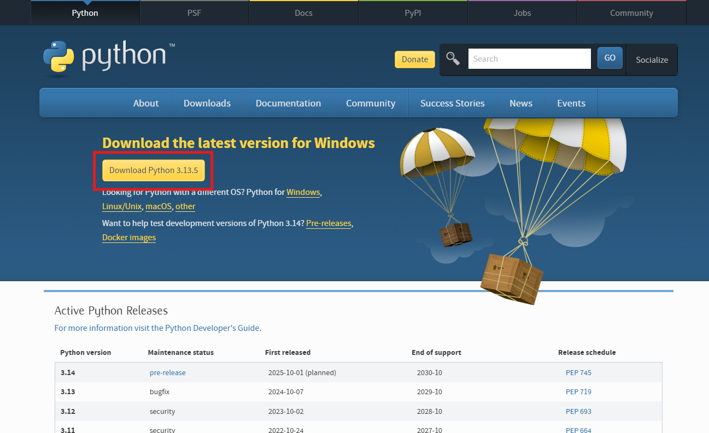
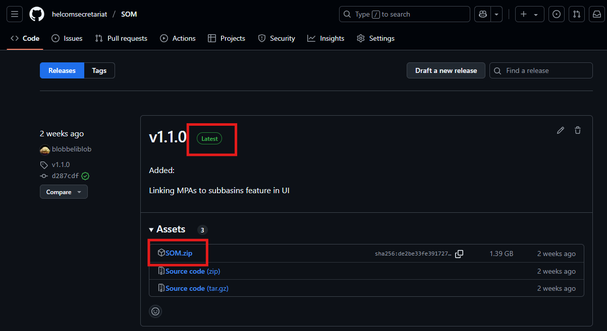
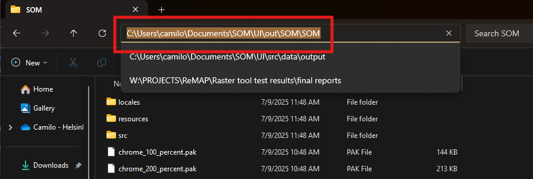
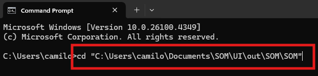
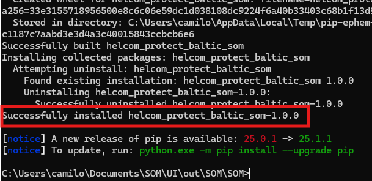
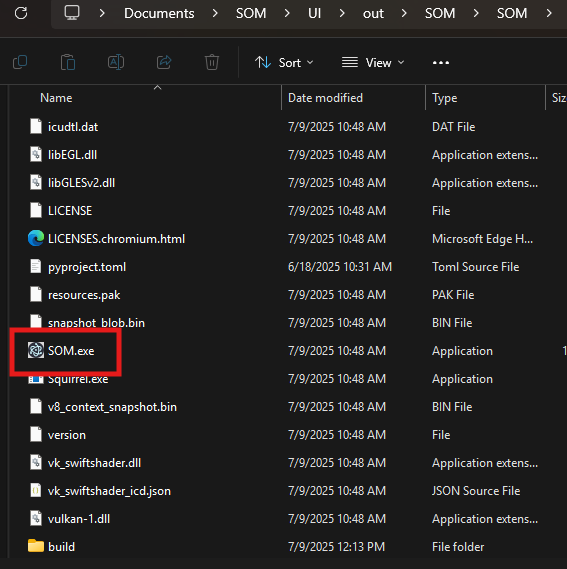

These steps go through the installation of the SOM package for normal users on a Windows system. 
For developers, see [Installation (developers)](installation-developers.md).

## 1. Installing Python

Running the SOM tool requires Python version 3.12 or above, which can be downloaded [here](https://www.python.org/downloads/). Follow the installer instructions to set it up. If you are unsure about any options, it is recommended to leave the default settings on.



## 2. Download the model

The tool can be downloaded from [here](https://github.com/helcomsecretariat/SOM/releases). Make sure to download the latest release.



Once downloaded, unzip the compressed file into your chosen directory. 

1. Right-click on the zip archive and select "Extract All"
2. Choose your destination folder
3. Click "Extract"

    

    

## 3. Installing requirements

With the tool extracted, we need to install the required Python dependencies.

1. From the extracted files, open the `SOM` directory.

    

2. Copy the path of the directory.

    

3. Open a terminal. This can be done by going to the Windows search field and typing `terminal`. Depending on your system, there might be several options available that will work, such as `Terminal`, `Command Prompt`, `Windows Powershell`.

    

4. In the terminal type the command `cd` followed by the copied path enclosed in quotes, and press ENTER.

    

5. Next, type the following command into the terminal:

    ```
    python -m pip install .
    ```

    

6. If done correctly, the terminal should show the following message:

    

## 4. Running the tool

With the requirements installed, the tool can now be run by clicking on the `SOM.exe` file in the directory. 




For more information, see [Using the tool (GUI)](using-the-gui.md).

