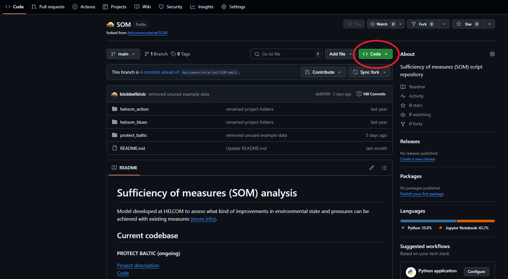
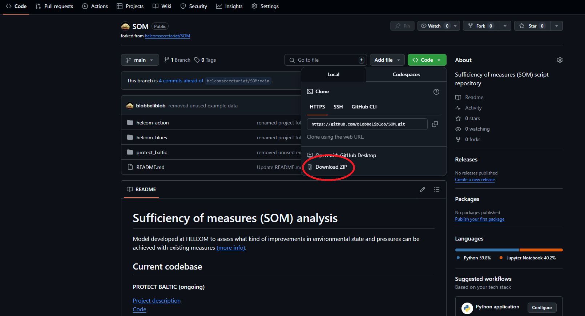

## Download the model

The code can be downloaded from the [repository](https://github.com/helcomsecretariat/SOM) (steps highlighted in red).




Once downloaded, unzip the archive into your project directory.

## Installing requirements

### Python

Running the SOM tool requires Python version 3.12 or above, which can be downloaded [here](https://www.python.org/downloads/). Follow the installer instructions to set it up. 

### Setting up the environment

Open up a terminal and enter the following:

1. Navigate to your directory

    ```
    cd "/path/to/som"
    ```

2. Create a new python environment (optional):

    ```
    python -m venv .
    source bin/activate
    ```

3. Install dependencies:

    ```
    python -m pip install .
    ```

## Running the tool

To run the tool from the terminal:

```
python "/path/to/som/src"
```

Alternatively, see [Using the tool](using-the-tool.md).
