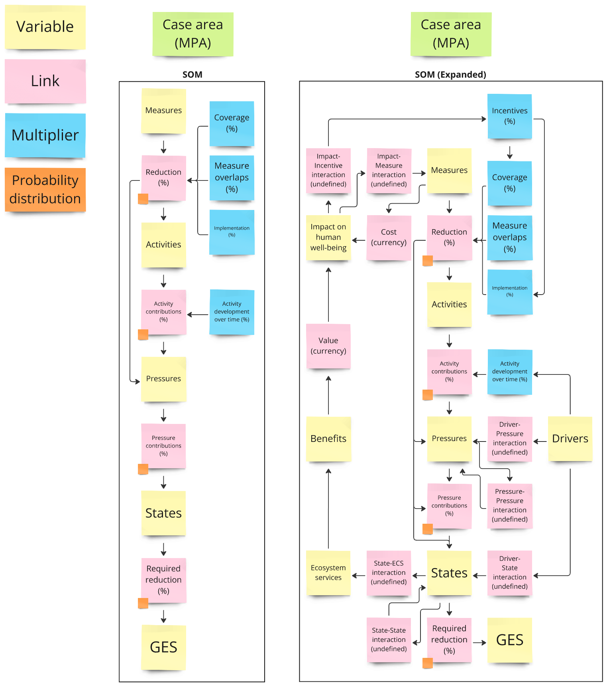

# Sufficiency of Measures model

This project continues on the work done on the SOM model in the [HELCOM BLUES](https://github.com/helcomsecretariat/SOM/tree/main/helcom_blues) project as part of the [HELCOM PROTECT BALTIC](https://protectbaltic.eu/) project. 

## Installation

Requires Python version 3.12 or above.

1. Create an environment (optional):

```
cd "/path/to/protect_baltic"
python -m venv .
source bin/activate
```

2. Install dependencies:

```
python -m pip install .
```

3. Run tool:

```
python "/path/to/protect_baltic/src"
```

## Setup

The *src/config.toml* file contains settings controlling the model, as well as paths to the input data for the user to adjust.

## SOM

The scientific foundation of the SOM model framework can be found [here](https://helcom.fi/baltic-sea-action-plan/som/).

### Context

The model links measures, human activities, pressures, and environmental states together to assess the improvements that can be achieved in the pressures and states through the implementation of measures. This is further compared against set thresholds to observe whether the improvements are sufficient to achieve Good Environmental Status (GES). 

### Input

The input data consists of three files:
- generalInput.xlsx
- measureEffectInput.xlsx
- pressureStateInput.xlsx

Example data has been provided in the *src/data* folder.

```generalInput.xlsx``` contains descriptions of the model domain:

- ```sheet:Measure ID```: Unique identifiers for measures
- ```sheet:Activity ID```: Unique identifiers for activities
- ```sheet:Pressure ID```: Unique identifiers for pressures
- ```sheet:State ID```: Unique identifiers for states
- ```sheet:Area ID```: Unique identifiers for areas
- ```sheet:Case ID```: Unique identifiers for cases
- ```sheet:ActMeas```: Implemented measure cases, all rows are independent, multiple IDs can be joined by a semi-colon.
    - ```column:ID```: Unique case id, linked to ```sheet:Case ID```
    - ```column:measure```: Measure type ID, linked to ```sheet:Measure ID```
    - ```column:activity```: Relevant Activities, linked to ```sheet:Activity ID```, the value 0 (zero) means all relevant activities affected by the measure
    - ```column:pressure```: Relevant Pressures, linked to ```sheet:Pressure ID```, the value 0 (zero) means all relevant pressures affected by the measure
    - ```column:state```: Relevant States, linked to ```sheet:State ID```, the value 0 (zero) means all relevant states affected by the measure
    - ```column:coverage```: Multiplier (fraction), represents how much of the area is covered by the measure
    - ```column:implementation```: Multiplier (fraction), represents how much of the measure is implemented
    - ```column:area_id```: Area ID, linked to ```sheet:Area ID```
- ```sheet:ActPres```: Activity-Pressure links, how much the individual activities contribute to the pressures
    - ```column:Activity```: Activity ID, linked to ```sheet:Activity ID```
    - ```column:Pressure```: Pressure ID, linked to ```sheet:Pressure ID```
    - ```column:area_id```: Area ID, linked to ```sheet:Area ID```, multiple IDs can be joined by a semi-colon
    - ```column:Ml#```: Most likely contribution (%)
    - ```column:Min#```: Lowest potential contribution (%)
    - ```column:Max#```: Highest potential contribution (%)
- ```sheet:DEV_scenarios```: Activity development scenarios
    - ```column:Activity```: Activity ID, linked to ```sheet:Activity ID```
    - ```column:BAU```: Business As Usual, how much the activity will change without extra action (fraction)
    - ```column:ChangeMin```: Lowest potential change (fraction)
    - ```column:ChangeML```: Most likely change (fraction)
    - ```column:ChangeMax```: Highest potential change (fraction)
- ```sheet:Overlaps```: Interaction between separate measures, how joint implementation affects measure efficiency
    - ```column:Overlap```: Overlap ID
    - ```column:Pressure```: Pressure ID, linked to ```sheet:Pressure ID```
    - ```column:Activity```: Activity ID, linked to ```sheet:Activity ID```
    - ```column:Overlapping```: Overlapping measure ID, linked to ```sheet:Measure ID```
    - ```column:Overlapped```: Overlapped measure ID, linked to ```sheet:Measure ID```
    - ```column:Multiplier```: Multiplier (fraction), how much of the ```column:Overlapped``` measure's effect will be observed if ```column:Overlapping``` is also implemented
- ```sheet:SubPres```: Links between separate pressures, where *subpressures* make up part of *state pressures*
    - ```column:Reduced pressure```: Subpressure ID, linked to ```sheet:Pressure ID```
    - ```column:State pressure```: State pressure ID, linked to ```sheet:Pressure ID```
    - ```column:Equivalence```: Equivalence between ```column:Reduced pressure``` and ```column:State pressure```, i.e. how much of the *state pressure* is made up of the *subpressure*, where values between 0 and 1 are treated as fractions, and other values as either no quantified equivalence or no reduction from pressures
    - ```column:State```: State ID, linked to ```sheet:State ID```

```measureEffectInput.xslx``` contains survey data on the effects of measures on activity-pressure pairs as surved by expert panels:

- ```sheet:MTEQ```: General information on the survey questions, each row corresponds to a unique activity-pressure pair, the value 0 (zero) for the Activity, Pressure and State columns is used to denote no value, used for *direct to pressure* / *direct to state* measures
    - ```column:Survey ID```: Survey ID, each unique id corresponds to a specific sheet in ```measureEffectInput.xslx```
    - ```column:Activity```: Activity ID, linked to ```generalInput.xlsx:Activity ID```
    - ```column:Pressure```: Pressure ID, linked to ```generalInput.xlsx:Pressure ID```
    - ```column:State```: State ID, linked to ```generalInput.xlsx:State ID```
    - ```column:AMT```: Amount of measures linked to the activity-pressure pair in the corresponding survey sheet
    - ```column:Exp#```: Expert columns, details the number of experts that gave each answer, used for weighting
- ```sheet:Surveys```: Survey sheets detailing the effects of the measures on the activity-pressure pairs in ```sheet:MTEQ```
    - ```column:expert ID```: Expert ID, linked to the corresponding expert columns in ```sheet:MTEQ```
    - ```column:#```: Measure IDs as columns, linked to ```generalInput.xlsx:Measure ID```, each measure takes two columns
        - the first column describes the most likely reduction (%) of the measure on the activity-pressure pair
        - the second column describes the potential uncertainty range (%) regarding the reduction
    - ```column:ME```: The actual effect of the most effective measure for the current activity-pressure pair

```pressureStateInput.xlsx``` contains survey data on pressure contributions to states and total pressure load reduction targets:

- ```sheet:PSQ```: General information on the survey questions, each row corresponds to a unique state-area pair
    - ```column:State```: State ID, linked to ```generalInput.xlsx:State ID```
    - ```column:area_id```: Area ID, linked to ```generalInput.xlsx:Area ID```, multiple IDs can be joined by a semi-colon
    - ```column:GES known```: Is the GES threshold known, 0 for no, 1 for yes
    - ```column:Exp#```: Expert columns, details the number of experts that gave each answer, used for weighting
- ```sheet:Surveys```: Survey sheets detailing the contributions of individual pressures to states and the total pressure load reduction targets for the state, the targets are for PR (=GES), 10 %, 25 % and 50 % improvement in state
    - ```column:Expert```: Expert ID, linked to the corresponding expert columns in ```sheet:PSQ```, each expert's answers comprise a block of rows corresponding to the state-area pair rows in ```sheet:PSQ```
    - ```column:P#```: Pressure IDs, linked to ```generalInput.xlsx:Pressure ID```
    - ```column:S#```: Significance of corresponding ```column:P#```, used when weighing contributions of each pressure
    - ```column:MIN#```: Lowest potential threshold value (%)
    - ```column:MAX#```: Highest potential threshold value (%)
    - ```column:ML#```: Most likely threshold value (%)

Model file structure (in *src* directory):

- ```__main__```: runs the tool
- ```config.toml```: configuration settings
- ```som_app.py```: main calculations are performed here
- ```som_tools.py```: input data loading functions
- ```utilities.py```: small utility functions

### Model flow

The model links together the various inputs as shown in the diagram below.



The figure above details the links between each element of the model, both for the original model developed in the [ACTION](https://helcom.fi/helcom-at-work/projects/action/) project and further expanded on in the [BLUES](https://helcom.fi/helcom-at-work/projects/blues/) project. For each individual simulation run, these calculations occur:

1. An individual random sample is picked from each of the probability distributions representing the measure reductions, activity and pressure contributions, and GES thresholds.

2. Activity contributions are multiplied by their respective development factor for the chosen scenario.

3. Pressure levels are reduced by the reduction in its respective activity contributions (or directly through straight-to-pressure measures).
    - Reduction = Coverage * Implementation * Measure overlaps * Measure reduction * Activity contribution

4. Total pressure load levels on environmental states are reduced by the reduction in its respective pressure contributions (or directly through straight-to-state measures).
    - Reduction = Pressure level reduction * Pressure contribution

### Next development steps

The tool will implement the following aspects:

- Multiple simulations to assess uncertainty of results
- Incorporating GIS layers in determining cases and areas
- Result visualisation

Possible future development steps to implement (but are not yet due to lack of data):

- Ecosystem services & Benefits
- Impact on human well-being
- Incentives
- Drivers
